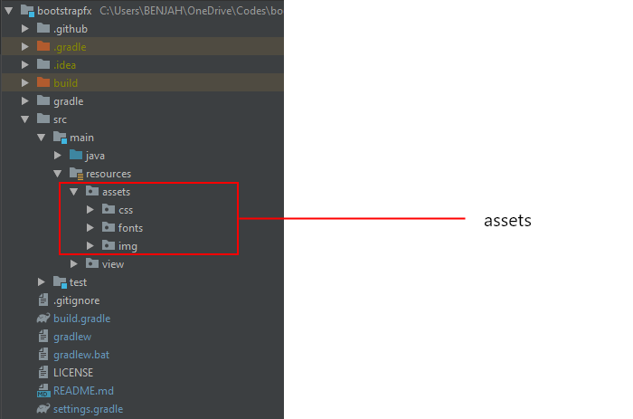
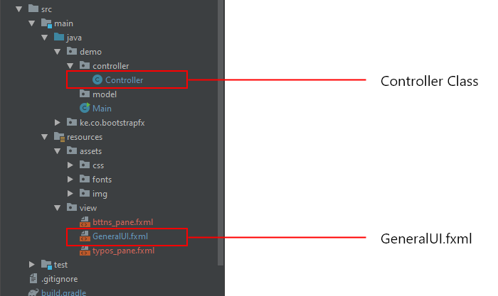
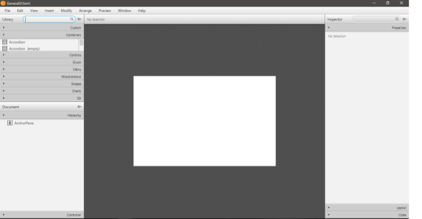
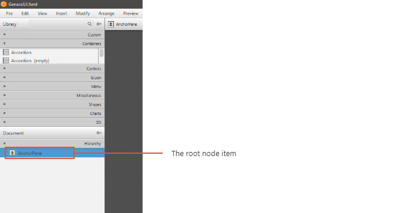
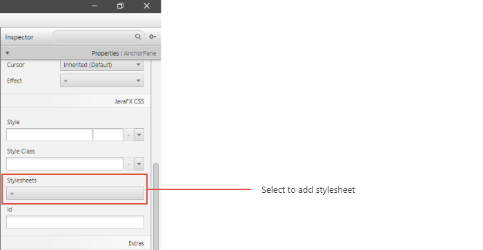
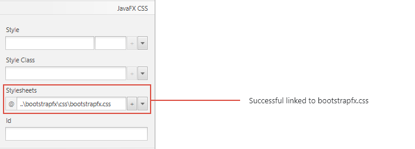
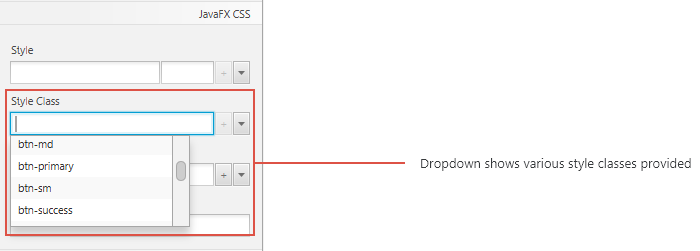

<p align="center">
    
</p>
<h2 align="center"> BootstrapFX </h2>
<p align="center">
    <small> &mdash; Version 1.0 Alpha </small>
    <br> <br>
    Get started with BootstrapFX, a front-end component library to help in the quick development of JavaFX user 
    interfaces with extensive pre-styled components.
    <br> <br>
    <a href="https://github.com/wasulabenjamin/bootstrapfx/issues/new?template=bug_report.md">Report bug</a> . 
    <a href="https://github.com/wasulabenjamin/bootstrapfx/issues/new?template=feature_request.md">Request feature</a>
</p>

# Table of Contents
- [Introduction](#bootstrapFX)
- [Documentation](#documentation)
- [Getting Started](#getting-started)
- [Importing library](#importing-library)
- [Starter Templates](#starter-templates)
- [Important Globals](#important-globals)
- [Bugs and Feature Requests](#bugs-and-feature-requests)
- [Contributing](#contributing)
- [Aim](#aim)

# BootstrapFX
BootstrapFX is an open source modular component library that primarily consists of a pre-styled style-sheet implementing 
the various JavaFX components. The style-sheets is compiled into a single CSS bundle to be included in FXML pages. 
BootstrapFX provides a number of configuration variables that control things such as color and padding of various 
components. Each BootstrapFX component class consists of an  FXML structure, CSS  declarations, and in some cases 
accompanying Java code.

### Stylesheet
BootstrapFX provides basic style definitions for major key FXML components. These provide a uniform, modern appearance 
for formatting text, buttons, tables, form elements, etc.

### Code components
BootstrapFX comes with several code components in the form of Java Classes. These provide additional user interface 
elements such as animations, and in some cases pre-re-factored code. They also extend the functionality of some existing 
interface elements, including for example; auto-validate functions for input fields.

# Documentation
BootstrapFX's documentation is included within the source code of this repository. 
[Download](https://github.com/wasulabenjamin/bootstrapFX/archive/master.zip) or clone this repository and run locally on 
IDE for detailed information on the framework contents, templates, examples, and more.

### Build
To build BootstrapFX, execute the following command:

    gradlew build

To run the main demo, execute the following command:

    gradlew run

**TO NOTE:**
* BootstrapFX requires **Java 1.8u162** and above.
* You need to set the `JAVA_HOME` environment variable to point to the Java 1.8 directory.
* Optionally, you can also use JFoenix &mdash; an open source Java library, that implements Google Material Design using 
Java components.

**New to JFoenix?** <br>
JFoenix is an open source Java library, that implements Google Material Design using Java components.
* To add JFoenix in Scene Builder see [tutorial.](https://www.youtube.com/watch?v=yvI9HTP54gI)
* To add JFoenix in IntelliJ IDEA see [tutorial.](https://www.youtube.com/watch?v=S5Vb5r1_zVU)
* To add JFoenix in Netbeans IDE see [tutorial.](https://www.youtube.com/watch?v=0jKct1geeHc)
* To add JFoenix in Gradle or Maven project see 
[tutorial.](https://github.com/jfoenixadmin/JFoenix#how-can-i-use-jfoenix)

# Getting Started
Looking to quickly add BootstrapFX to your project? Follow along with the following steps to get started in a simple an 
intuitive way.

<b>Preliminary.</b> Download the BootstrapFX package from [here](https://bit.ly/bootstrapfx-package).

Within the downloaded BootstrapFX package you'll find the following directories and files, logically grouping common 
assets. You'll see something like this:
```text
bootstrapfx/
  ├── assets/
  │   ├── css/
  │   │   ├── bootstrapfx.css
  │   │   └── bootstrapfx.min.css
  │   ├── fonts/
  │   │   └── *.ttf
  │   └─── img/
  │       └── *.png
  └── bootstrapfx.jar
```
This is the most basic form of BootstrapFX for quick drop-in usage in nearly any JavaFX project. The package doesn't 
include documentation, source files, or any optional dependencies (jfoenix).

<b>Step 1.</b> Extract the downloaded archive. Make sure to select the `Extract Here` option. Now, open the extracted 
folder and copy the `assets` folder into the `resources` folder of your project.
<p align="center">  </p>

<b>Step 2.</b> Create a new *.fxml* file in your view package and create it's *Controller* class in the controller 
package as shown below.
<p align="center">  </p>

<b>Step 3.</b> Now open the *.fxml* file with SceneBuilder as shown below - In this case, the <b>GeneralUI.fxml</b>
<p align="center">  </p>

<b>Step 4.</b> On the left hand side menu, go to <b>Document->Hierarchy</b> and select the root node item - In this case 
an AnchorPane.
<p align="center">  </p>

<b>Step 5.</b> On the right hand side menu, go to <b>Properties->JavaFX CSS</b> and then select to add stylesheet.
<p align="center">  </p>

<b>Step 6.</b> On the new pop-up window that appears, navigate to css folder located in the resource folder of your 
project and select stylesheet &mdash; `bootstrapfx.css`. Optionally you can also chose to use the `bootstrapfx.min.css` 
for a minified css version.
<p align="center">  </p>

<b>Step 7.</b> Now you can use the various style classes provided by bootstrapfx with major key FXML components i.e., 
Buttons, TextFields, Radios etc. as shown below
<p align="center">  </p>

# Importing library
### Adding JAR File
To manually add `bootstrapfx.jar` into your project, see:
* [Tutorial](https://www.jetbrains.com/help/idea/library.html#define-library) to add jar file in IntelliJ IDEA, or see,
* [Tutorial](https://www.foxinfotech.in/2019/03/how-to-add-external-jar-file-in-netbeans-project.html) to add jar file 
in Netbeans IDE.

### Gradle
Step 1. Add the JitPack repository to your build file
```gradle
repositories {
    mavenCentral()
    maven { url 'https://jitpack.io' } //The JitPack repository
}      
```
Step 2. Add the dependency
```gradle
dependencies {
    implementation 'com.github.wasulabenjamin.bootstrapfx:lib:-SNAPSHOT'
}     
```

### Maven
Step 1. Add the JitPack repository to your build file
```xml
<repositories>
    <repository>
        <id>jitpack.io</id>
        <url>https://jitpack.io</url>
    </repository>
</repositories>
```
Step 2. Add the dependency
```xml
<dependency>
    <groupId>com.github.wasulabenjamin.bootstrapfx</groupId>
    <artifactId>lib</artifactId>
    <version>-SNAPSHOT</version>
</dependency>
```

The first time you request the project JitPack checks out the code, builds it and serves the build artifacts (jar).

# Starter Templates
Be sure to have your pages set up with the latest design and development standards. That means specifying the XML 
version and encoding declaration to generally describe general properties of the document. Putting it all together and 
your FXML document should look like this:
```xml
<?xml version="1.0" encoding="UTF-8"?>

<?import java.lang.*?>
<?import java.util.*?>
<?import javafx.scene.*?>
<?import javafx.scene.control.*?>
<?import javafx.scene.layout.*?>

<AnchorPane prefHeight="400.0" prefWidth="600.0" 
            stylesheets="@../assets/css/bootstrapfx.css" 
            xmlns="http://javafx.com/javafx/8.0.111" 
            xmlns:fx="http://javafx.com/fxml/1" 
            fx:controller="demo.controller.Controller">
    <Button layoutX="126" layoutY="90" text="Click Me!" onAction="#handleButtonAction" fx:id="button" />
    <Label layoutX="126" layoutY="120" minHeight="16" minWidth="69" fx:id="label" />
</AnchorPane>
```
Many but not all of the components require the use of BootstrapFX Java library to function. Specifically, they require 
the `BootstrapFX.java` class. Make sure to extend this class. Piecing it all together and your Controller class should 
look like this:
```java
package demo.controller;

import com.github.wasulabenjamin.bootstrapfx.BootstrapFX;
import javafx.event.ActionEvent;
import javafx.fxml.FXML;
import javafx.fxml.Initializable;
import javafx.scene.control.Label;

import java.net.URL;
import java.util.ResourceBundle;

public class Controller extends BootstrapFX implements Initializable {
    @FXML 
    private Label label;

    @FXML 
    private void handleButtonAction(ActionEvent event) {
        System.out.println("You clicked me!");
        label.setText("Hello World!");
    }

    @Override
    public void initialize(URL location, ResourceBundle resources) {}
}
```
Curious about which components explicitly require `BootstrapFX.java`? 
Please read through the [BootstrapFX Documentation](#documentation).

# Important Globals
BootstrapFX employs a handful of important global styles and settings used by [Bootstrap](https://getbootstrap.com/) 
that you’ll need to be aware of when using it, all of which are almost exclusively geared towards the normalization of 
cross platform styles.

# Bugs and Feature Requests
Have a bug or a feature request? **Here is to how we can help:** 
* Having problems with BootstrapFX? 
[Please report a bug](https://github.com/wasulabenjamin/BootstrapFX/issues/new?template=bug_report.md).
* Is your problem or idea you would wish implemented not addressed yet?
[Please request a feature](https://github.com/wasulabenjamin/BootstrapFX/issues/new?template=feature_request.md).

# Contributing
Looking to contribute something to BootstrapFX?

Please read through our 
[contributing guidelines](https://github.com/wasulabenjamin/BootstrapFX/blob/master/.github/CONTRIBUTING.md). 
Included are directions for opening issues, coding standards, and notes on development.

# Aim
The main aim of this project is to develop an effective framework, which automatically integrates with existing JavaFX 
code to generate better quality user interfaces within a short time period.